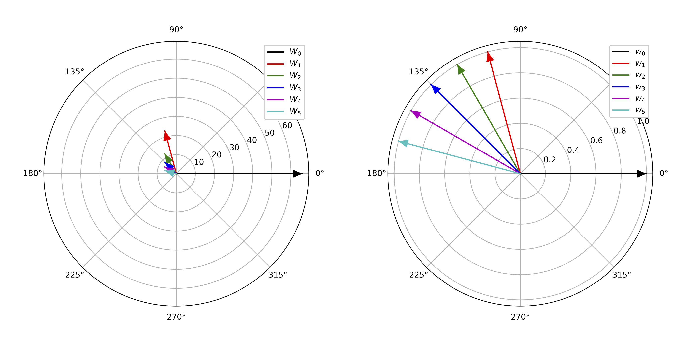
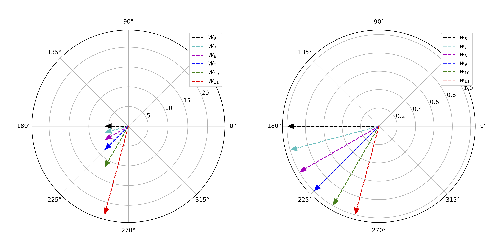
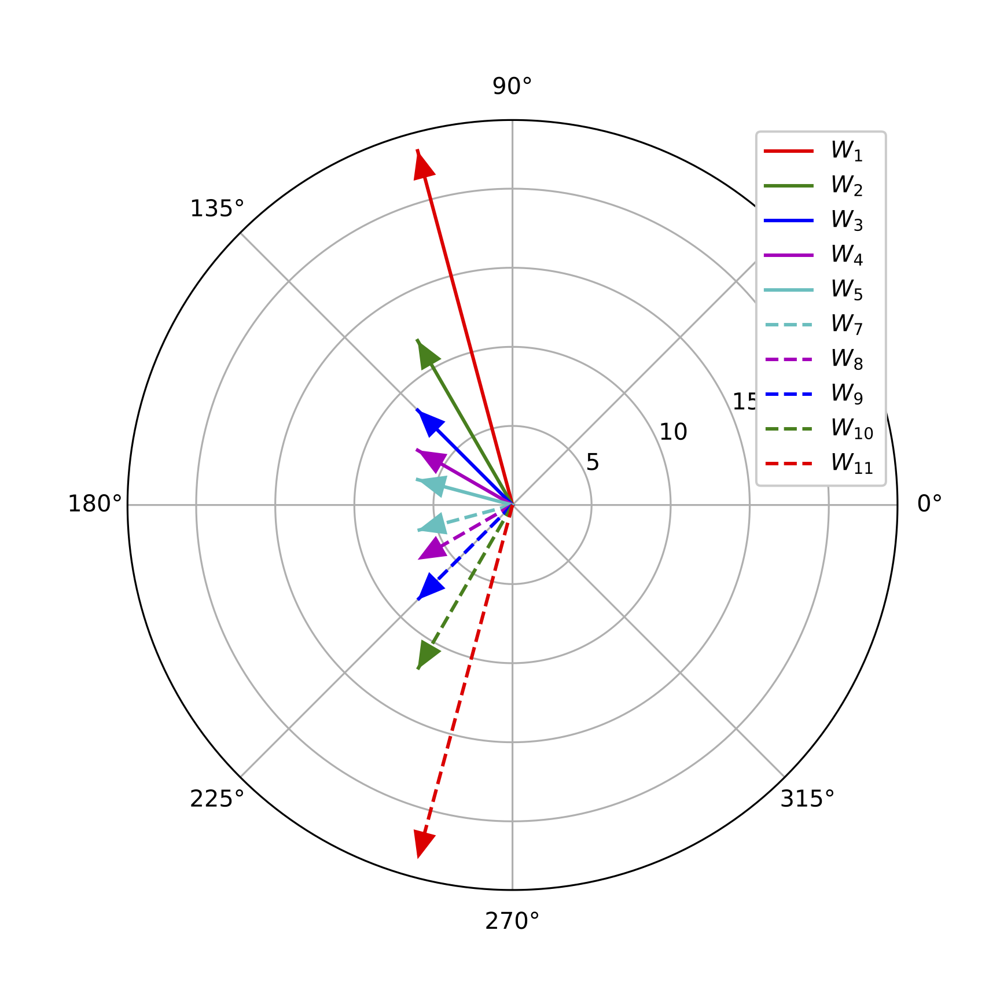
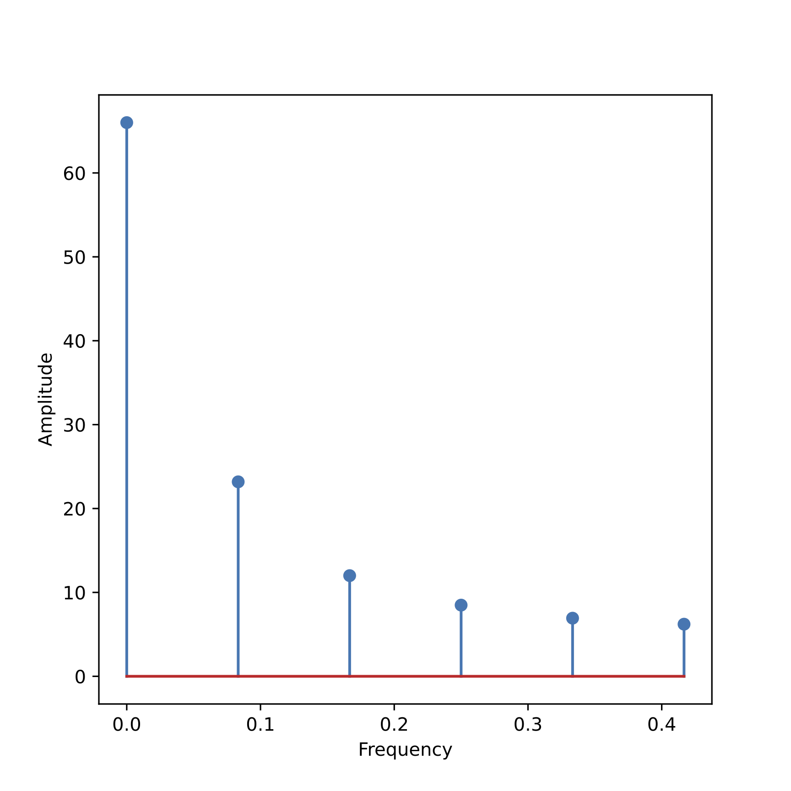
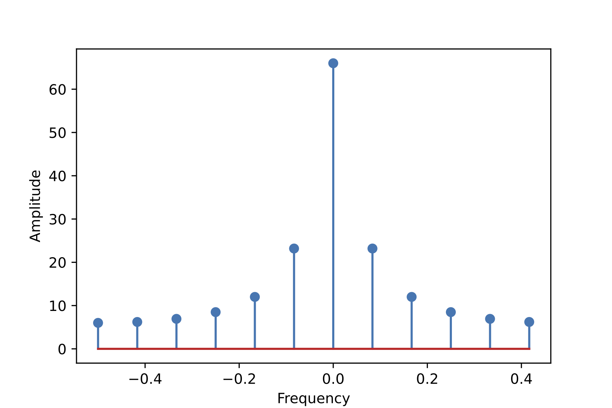

+++
title = "傅里叶分析（Fourier analysis）基础（2）——Python实现"
date = "2023-08-27"
author = "xy"
draft = false
+++

接着上一篇[《傅里叶分析（Fourier analysis）基础（1）——理论》](../fourier-basis-theory)，我们选取[scipy.fft](https://docs.scipy.org/doc/scipy/tutorial/fft.html#fast-fourier-transforms)）来进行傅里叶分析。

## 使用 `scipy.fft` 做傅里叶分析
为了统一符号，接下来我们在notebook中都使用小写变量 $x$ 表示时域信号（函数），大写变量 $X$ 表示频域表征。 

首先定义一段时域长度为 $N$ 的时域信号（$N=12$）：
```console
>>> import numpy as np
>>> N = 12
>>> x = np.arange(N)
>>> x
array([ 0,  1,  2,  3,  4,  5,  6,  7,  8,  9, 10, 11])
```

接下来，使用`scipy.fft`进行离散傅里叶转换：

```console
>>> from scipy.fft import fft
>>> X = fft(x)
>>> X
array([66. -0.j        , -6.+22.39230485j, -6.+10.39230485j,
       -6. +6.j        , -6. +3.46410162j, -6. +1.60769515j,
       -6. -0.j        , -6. -1.60769515j, -6. -3.46410162j,
       -6. -6.j        , -6.-10.39230485j, -6.-22.39230485j])
>>> len(X)
12
```

可见，离散傅里叶变换得到的频域表征 $X$ 与时域信号 $x$ 长度相等，$N=12$。每个频率分量 $X_k$ 都是复数，可表示成 $X_k=a+b\cdot j$ 的形式（$k=0,2\dots 11$）。例如，$X_1=-6+22.39j$。

其中 $\\{X_1,X_2,\dots,X_5\\}$ 这 5 个频率分量表示正频率，因其所对应的角频率 $\omega_k=2\pi \frac{k}{N}$ 均在 $[0,\pi)$ 之间：

$$
\omega_1=2\pi\frac{1}{12},\ \omega_2=2\pi\frac{2}{12},\ \omega_3=2\pi\frac{3}{12},\ \omega_4=2\pi\frac{4}{12},\ \omega_5=2\pi\frac{5}{12}
$$

在极坐标轴上表示如下（左图为原向量，右图为归一化后的向量）：

<p align="center">

</p>


$\\{X_1,\dots,X_{5}\\}$ 与后 5 个负频率分量 $\\{X_6,\dots,X_{11}\\}$ 成共轭（conjugate）关系，即：

$$
X_{k}={\overline {X_{N-k}}}\quad (k=1,2,\dots,N-1)
$$

例如，$X_1=-6-22.39j$，$X_{11}=-6+22.39j$，他们的虚部是相反数。所以，$\\{X_6,\dots,X_{11}\\}$ 画在极坐标中如下。可见，$\\{X_6,\dots,X_{11}\\}$ 与 $\\{X_1,\dots,X_{5}\\}$ 的方向沿$x$轴翻转，但是长度相等。之所以左下图中 $w_{11}$（红色虚线）长度比左上图中 $w_{1}$ 看上去更长，是因为黑色水平向量 $w_6$ 的存在（对应 $X_6=-6-0.j$ ）

<p align="center">

</p>

为了避免 $X_0$ 和 $X_6$ 带来的混淆，我们将去除二者之后的10个角频率画出来，发现的确正频率（$\\{X_1,\dots,X_{5}\\}$）和负频率（$\\{X_7,\dots,X_{11}\\}$）是研 $x$ 轴对称的，如下图：

<p align="center">

</p>

综上所述，我们分析频谱时，只需关注正频率（或负频率）一边即可。
回到上面的例子，5个正频率分量 $X_1$ 到 $X_5$ 分别是：

$$
\begin{aligned}
X_1&=-6+22.39j => |X_1| = \sqrt{(-6)^2+(22.39)^2} = 23.18\\\\
X_2&=-6+10.39j => |X_2| = \sqrt{-6.00^2 + 10.39^2} = 12.00\\\\
X_3&=-6+6j => |X_3| = \sqrt{-6.00^2 + 6.00^2} = 8.49\\\\
X_4&=-6+3.46j \Rightarrow |X_4| = \sqrt{-6.00^2 + 3.46^2} = 6.93 \\\\
X_5&=-6+1.61j \Rightarrow |X_5| = \sqrt{-6.00^2 + 1.61^2} = 6.21 \\\\
\end{aligned}
$$

再加上零频率 $X_0$，我们得到了频谱的幅度谱（amplitude spectrum）：

<p align="center">

</p>

## 使用 `fftfreq` 和 `fftshift` 绘制频谱
上一张频谱图的绘制代码如下：

```python
from scipy.fft import fftfreq
xf = fftfreq(N)[:6]
plt.stem(xf, np.abs(X[:6]), use_line_collection=False)
```

`fftfreq` 的功能是返回傅里叶变换的频点，这里参数 `N=12` 是我们时域信号的长度，`fftfreq(12)` 返回的是 $[0,1)$ 区间内的12个频率点：

```console
>>> print(fftfreq(12))
[ 0.          0.08333333  0.16666667  0.25        0.33333333  0.41666667
 -0.5        -0.41666667 -0.33333333 -0.25       -0.16666667 -0.08333333]
>>> print(len(fftfreq(12)))
12
```
前面1-5项是正频率，即 $\omega_1\dots \omega_5$ 的频率系数：$[\frac{1}{12}, \frac{2}{12},\dots,\frac{5}{12}]$. 后面6-11项是负频率（逆序），即 $\omega_{11}\dots \omega_6$ 的系数：$[-\frac{6}{12}, -\frac{5}{6},\dots,-\frac{1}{12}]$。

所以绘图时，可以用 `ffreq(N)[:6]` 语句来只取前6项作为 x 轴坐标。或者用 `fftshift` 将负频率移到前面，和正频率排成按 0 点对称的形式：

```console
>>> from scipy.fft import fftshift
>>> xf = fftfreq(12)
>>> xf = fftshift(xf)
>>> print(xf)
[-0.5        -0.41666667 -0.33333333 -0.25       -0.16666667 -0.08333333
  0.          0.08333333  0.16666667  0.25        0.33333333  0.41666667]
```

对频率分量 $X$ 也进行相应的 `fftshift`操作后，就可以绘制出包含正、负频率的完整频谱（沿 $y$ 轴对称）：
```python
X_plot = fftshift(X)
plt.stem(xf, np.abs(X_plot), use_line_collection=False)
```

<p align="center">

</p>