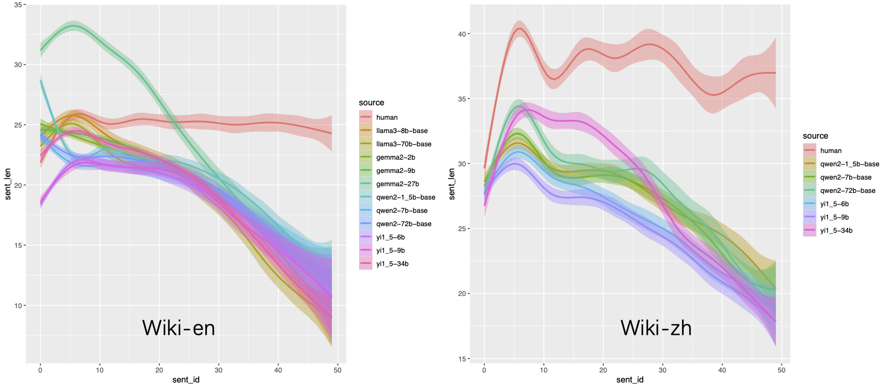
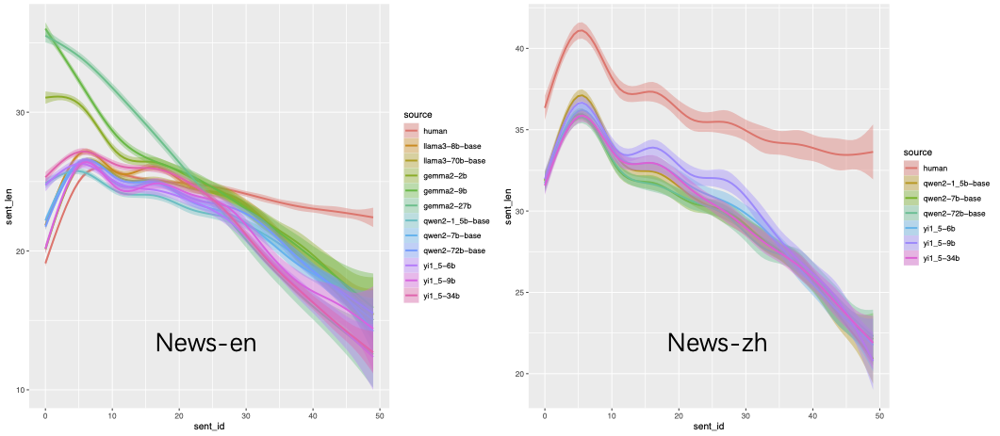
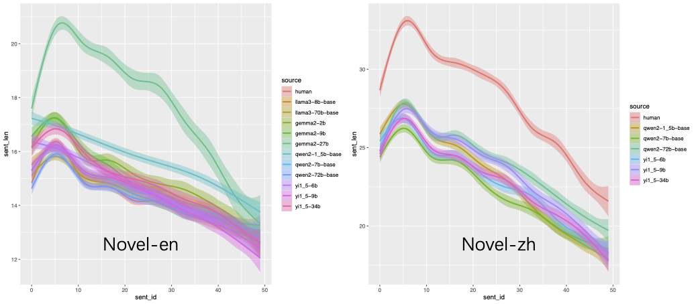

+++
title = "句子长度递减：大模型生成文本的有趣发现"
date = "2024-10-25"
author = "xy"
draft = false
+++

我们在最近的一项工作中发现，大模型生成文本的长度有随句子位置递减的趋势——且这一趋势与人类文本有所不同。

简单来说，在文档（wiki）、新闻（news）这类“正经”的文本上，人类“手写”文本的句子长度变化比较*平缓*，模型生成文本的句子长度的变化则较*陡峭*。

但是在小说（novel）类文本上，人类与模型没有明显差别：句子长度均呈陡峭的**下降**趋势。

或许，对撰写 wiki 文档这种知识专业性较强的写作任务，大脑的工作负荷较为均衡，因而句子长度更加一致；而在小说创作这种需要创意的“轻松”的任务，我们更倾向于偷懒——越写越短 :-) 